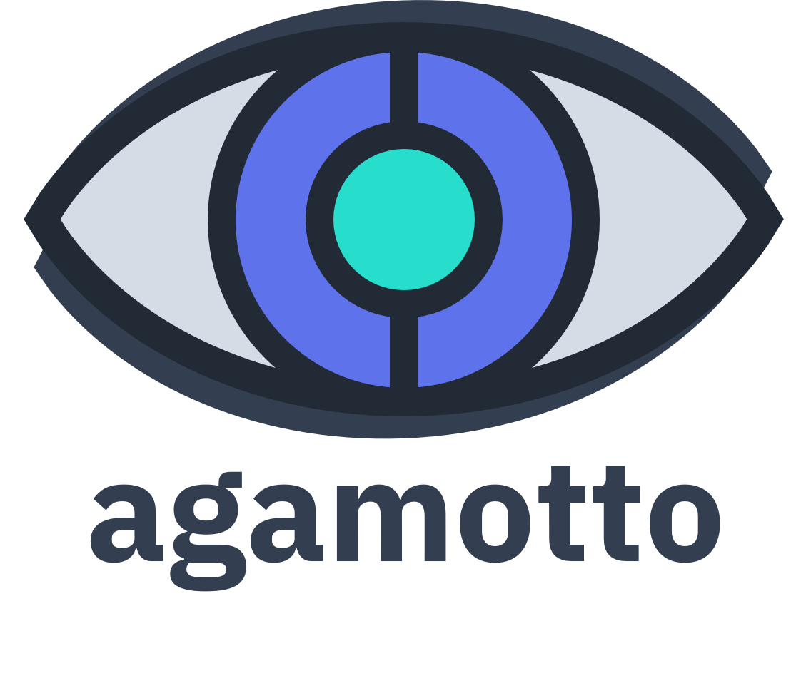

<p align="center">
    
</p>

# agamotto - Options Wheel Strategy Management
**agamotto** is a Flask app to manage your Wheel strategy. Like the MCU's [Eye of Agamotto](https://marvel.fandom.com/wiki/Eye_of_Agamotto), it allows you, the bold trader, to harness the power of ~~theta~~ time.

<br>
<p>
    <a href="https://www.python.org/">
        
    </a>
    <a href="https://flask.palletsprojects.com/en/2.0.x/">
        
    </a>
</p>

> **Note:** I've developed the basic prototype for **agamotto**. The code will be released in due time.

## Prerequisites

- A Linux OS
- Conda
- A TD Ameritrade API key
- If you want to operate the app on Docker:
    - Docker
    - Docker Compose

## Installation
Clone this repo to a local directory:

```bash
cd <your-directory>
git clone https://github.com/chrischow/agamotto.git
```

Create a Conda environment and install the required packages:

```bash
conda create -n agamotto
conda activate agamotto

cd agamotto
pip install -r requirements.txt
```

Create a `.env` file in the `agamotto` directory with the following variables:

```bash
API_KEY=<TD Ameritrade API key>
EMAIL=<Email cum username to initialise admin account>
PASSWORD=<Password to initialise admin account>
```

### Installation for Docker
I have yet to upload the image to Docker Hub. Until then, you'll need to build the Docker image:

```bash
cd agamotto
docker build --tag agamotto .
```

## Usage

### Without Docker
Run the following commands to launch **agamotto** in a new terminal:

```bash
cd agamotto
flask run
```

Note that this launches a development server, not a production server, but it should suffice for individual use.

### With Docker
Launch the app using Docker Compose. It can be accessed at `localhost:5050`.

```bash
docker-compose up
```

## Features
See the [documentation](https://chrischow.github.io/agamotto) for a walkthrough of the app.

## Upcoming Features
- [X] Login
- [X] Docker build
- [X] Strategy breakdown
    - [X] Overall table
    - [X] Plotly plot with wheel design
- [ ] Write documentation using [Just the Docs](https://github.com/pmarsceill/just-the-docs) ([demo site](https://pmarsceill.github.io/just-the-docs/))
- [ ] Admin dashboard - for what though
- [ ] Use of PostgreSQL database instead of SQLite


## About the Project
**agamotto** is © 2022 by Christian Chow.

### License
It is distributed under the [MIT License](LICENSE).
