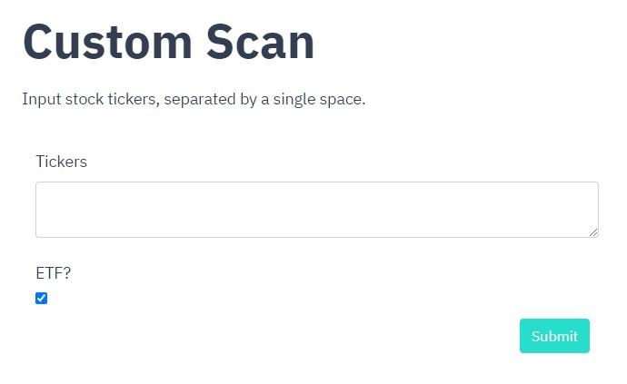

<p align="center">
    
</p>

# agamotto - Options Wheel Strategy Management
**agamotto** is A Flask app to manage your Wheel strategy. Like the MCU's [Eye of Agamotto](https://marvel.fandom.com/wiki/Eye_of_Agamotto), it allows you, the bold trader, to harness the power of ~~theta~~ time.

<br>
<p>
    <a href="https://www.python.org/">
        
    </a>
    <a href="https://flask.palletsprojects.com/en/2.0.x/">
        
    </a>
</p>

<div id="features"></div>

## Features
1. **[Dashboard](#dashboard):** Overview of profits
2. **[Monitor](#monitor):** Status of open trades
3. **[Manage](#manage):** View, add, and edit trades
4. **[Scan](#scan):** Run searches for profitable options
5. **[Analyse](#analyse):** Analyse search results

<div id="dashboard"></div>

### Dashboard
Provides an overview of profits (open, realised, total) overall, by ticker, and by trade.

<p align="center">
    
</p>

<div id="monitor"></div>

<a href="#features" style="font-size: 1.0rem;">Back to top ↩</a>

### Monitor
Provides an overview of open options positions. It includes a quick back-of-the-envelope calculation of returns from buying back, rolling one week out, and rolling two weeks out.

<p align="center">
    
</p>

More details on each position:

<p align="center">
    
</p>

<a href="#features" style="font-size: 1.0rem;">Back to top ↩</a>

<div id="manage"></div>

### Manage
View a list of all your trades. Each *trade* captures (1) an opening transaction, (2) a closing transaction, and (3) metadata about the trade.

<p align="center">
    
</p>

Add and edit trades:

<p align="center">
    
</p>

<a href="#features" style="font-size: 1.0rem;">Back to top ↩</a>

<div id="scan"></div>

### Scan
Scan options contracts across a list of tickers. Queries are run in separate threads.

Preset lists are provided (see bottom of README for full list):

<p align="center">
    
</p>

Alternatively, input a custom list of tickers to scan:

<p align="center">
    
</p>

<a href="#features" style="font-size: 1.0rem;">Back to top ↩</a>

<div id="analyse"></div>

### Analyse
After scans are run, analyse the results under this tab. Results from the scans are not automatically populated - manual refreshes are required.

<p align="center">
    
</p>

Click on the ID in the results list to see details about that contract. Mouseover the strike price to see a chart on the underlying.

<p align="center">
    
</p>

<a href="#features" style="font-size: 1.0rem;">Back to top ↩</a>

## Upcoming Features
- Login
- Admin dashboard
- Use of PostgreSQL database instead of SQLite

<a href="#features" style="font-size: 1.0rem;">Back to top ↩</a>

## Preset Lists for Scanning

#### iShares MSCI USA Min. Volatility Factor ETF

```
AAPL, ABT, AEP, AJG, AKAM, ALL, AMAT, AMCR, APH, ATVI, BAH, BAX, BKI, BLL, BMRN,
BMY, BRO, CARR, CBOE, CERN, CHD, CHRW, CL, CMCSA, CMS, CPB, CSCO, CTSH, CTXS, D,
DELL, DGX, DLTR, DUK, EA, EBAY, ED, ES, EVRG, EXPD, FIS, FISV, FOX, GILD, GIS,
HRL, HZNP, IAC, IBM, ICE, INCY, INTC, JNPR, K, KMB, KR, LNG, LNT, MDLZ, MDT,
MKC, MMC, MO, MRK, NEE, NEM, NET, NLOK, NWSA, OMC, ORCL, OTIS, PAYX, PFE, PG,
PGR, PM, PTON, ROL, RSG, SBUX, SGEN, SJM, SO, T, TEL, TMUS, TRV, TW, VZ, WCN,
WEC, WM, WMT, WU, XEL
```

#### Invesco QQQ Trust Series 1

```
AAPL, AEP, AMAT, AMD, ATVI, CDNS, CERN, CHKP, CMCSA, CPRT, CSCO, CSX, CTSH, DLTR,
EA, EBAY, EXC, FAST, FISV, FOX, FOXA, GILD, INCY, INTC, JD, KDP, KHC, MAR, MCHP,
MDLZ, MNST, MRVL, MU, MXIM, NTES, PAYX, PCAR, PDD, PTON, QCOM, ROST, SBUX, SGEN,
SIRI, SPLK, TCOM, TMUS, WBA, XEL, XLNX
```

#### Vanguard Growth Index Fund ETF

```
AAPL, ABNB, AFRM, AJG, AKAM, ALXN, AMAT, AMC, AMD, AME, APH, APP, ATUS, ATVI,
BAX, BF.A, BF.B, BKI, BLL, BMBL, BMRN, BMY, BSX, BSY, CBOE, CDNS, CERN, CGNX,
CHD, CHWY, CL, CNC, CPRT, CSGP, CTLT, CTXS, CZR, DBX, DDOG, DKNG, EA, EDR, EW,
EXAS, EXPD, FAST, FIS, FISV, FMC, GDDY, GDRX, HEI, HEI.A, HES, HLT, HZNP, IAC,
IBKR, ICE, INCY, INFO, INVH

LKQ, LNG, LW, LYFT, LYV, MAR, MAS, MCHP, MGM, MKC, MNST, MQ, MRVL, MU, MXIM, NET,
O, OPEN, OSH, PATH, PAYX, PENN, PINS, PLTR, PLUG, PPD, PTON, PXD, QCOM, QS, RBLX,
RCL, REG, ROL, ROST, SBUX, SEIC, SGEN, SIRI, SNAP, SPLK, SSNC, TER, TJX, TRMB,
TRU, TTD, TW, TWTR, U, UBER, UDR, VMEO, WAB, WCN, WMG, WYNN, XLNX, XM, YUM, Z,
ZG, ZI
```

#### ETFs with Weeklies

```
AGQ, AMLP, ARKF, ARKK, ASHR, BLCN, BLOK, DIA, DUST, EEM, EFA, EMB, ERX, EWC, EWH,
EWU, EWY, EWZ, FAS, FAZ, FEZ, FXE, FXI, GDX, GDXJ, GLD, HYG, IAU, IBB, ICLN, IEF,
IGV, IWF, IWM, IYR, JDST, JETS, JNUG, LABD, LABU, MJ, MSOS, QQQ, RSX, SDS, SIL,
SILJ, SLV, SMH, SPXU, SPY, SQQQ, SVXY, TAN, TBT, TECS, TLT, TQQQ, TZA, UNG, URA,
UUP, UVXY, VIXM, VIXY, VXX, XLC, XLE, XLF, XLI, XLK, XLY, XME, YINN
```

#### ETF: Above $100, Average Volume > 200k

```
ACWI, AGG, ARKK, ARKW, BLV, DIA, DPST, DVY, EDV, EFG, EMB, ESGU, FAS, FDN, FTEC,
GBIL, GLD, IBB, ICVT, IEF, IEI, IGV, IJH, IJJ, IJR, ITOT, IUSG, IVE, IVV, IWB,
IWD, IWF, IWM, IWN, IWO, IWP, IWS, IYR, IYT, IYW, JNK, LQD, MBB, MDY, MINT,
MTUM, MUB, OIH, QQQ, QQQM, QUAL, REMX, RSP, RWR, SCHA, SCHB, SCHG, SCHX, SDY,
SHV, SKYY, SMH, SOXX, SPXL, SPY, SSO, STIP, TIP, TLT, TQQQ, UPRO, URTY, VB, VBR,
VCLT, VGT, VHT, VIG, VLUE, VNQ, VO, VOE, VOO, VT, VTI, VTV, VUG, VV, VXF, VYM,
XBI, XLI, XLK, XLV, XLY
```

#### ETF: $50-100, Average Volume > 200k

```
AAXJ, ACWX, ARKF, ARKG, ARKQ, BBEU, BBJP, BIL, BIV, BND, BNDX, BOIL, BRZU, BSV,
CIBR, CQQQ, CWB, CXSE, DDM, DGRO, DGRW, DXJ, EEM, EEMV, EFA, EFAV, EFV, EMQQ,
EMXC, EPP, EWJ, EWT, EWW, EWY, EZU, FIXD, FLOT, FNCL, FNDX, FTCS, FTSM, GSLC,
GSY, GUSH, HDV, HYD, HYG, HYS, IAGG, IAT, ICSH, IEFA, IEMG, IEUR, IEV, IGIB,
IGLB, IGSB, IHI, IJK, IJS, IPO, ISTB, ITB, IUSB, IUSV, IVW, IWR, IXG, IXN, IXUS,
IYF, JEPI, JMST, JNUG, JPST, KBE

KBWB, KRE, LABU, LIT, LMBS, MCHI, MDYV, MOAT, NAIL, NEAR, NOBL, NUGT, ONEQ, PBW,
PKW, QCLN, QLD, RPV, SCHD, SCHM, SCHO, SCHP, SCHR, SCHV, SCHZ, SCZ, SHY, SLQD,
SLYV, SPHB, SPLG, SPLV, SPTM, SPYG, SVXY, TAN, TECL, TFI, TMV, TNA, UCO, UDOW,
USIG, USMV, USRT, UWM, VCIT, VCSH, VDE, VEA, VEU, VFH, VGIT, VGK, VGLT, VGSH,
VMBS, VNLA, VNQI, VONG, VONV, VPL, VTEB, VTIP, VTWO, VWO, VWOB, VXUS, WCLD, XHB,
XLB, XLC, XLP, XLU, XOP, XRT
```

#### ETF: $20-50, Average Volume > 200k

```
AGQ, AMLP, ANGL, ARKX, ASHR, BAB, BDRY, BKLN, BLOK, BOTZ, BSCL, BUG, BWX, CHIQ,
CLOU, COMT, COPX, CPER, CWEB, DBB, DBEF, DFAC, DFAU, DJP, DOG, DRIV, DRN, DUST,
EBND, ECH, EIDO, EMLC, EMLP, EPI, ERX, ESGE, EWA, EWC, EWD, EWG, EWH, EWI, EWL,
EWM, EWP, EWQ, EWS, EWU, EWZ, EZA, FALN, FAZ, FEZ, FLRN, FNDE, FNDF, FPE, FREL,
FTGC, FTSL, FVD, FXI, FXO, GDX, GDXJ, GOVT, GSIE, GUNR, HEFA, HNDL, HYLB, IAU,
ICLN, IDV, IGE, IGF, ILF, INDA, INFL, IQLT, IVLU, IVOL

IXC, IYE, JETS, KIE, KSA, KWEB, LABD, MLPA, MSOS, NUSI, PAVE, PCY, PDBC, PEJ, PFF,
PFFD, PICK, PTBD, PULS, PXH, PZA, QQQJ, QYLD, RDVY, REET, REM, RSX, RWM, RWX, SCHC,
SCHE, SCHF, SCHH, SDOW, SHYG, SIL, SIVR, SJNK, SLV, SOXL, SPAB, SPDW, SPEM, SPHD,
SPHQ, SPIB, SPIP, SPLB, SPMB, SPMD, SPSB, SPSM, SPTI, SPTL, SPTS, SPXS, SPYD, SPYV,
SRLN, SRVR, SUSB, TIPX, TMF, TOTL, TUR, TZA, URA, USFR, USHY, USO, UUP, UVXY, VIXY,
VRP, VXX, XLE, XLF, XLRE, XME, XSOE, ZSL
```

<a href="#features" style="font-size: 1.0rem;">Back to top ↩</a>