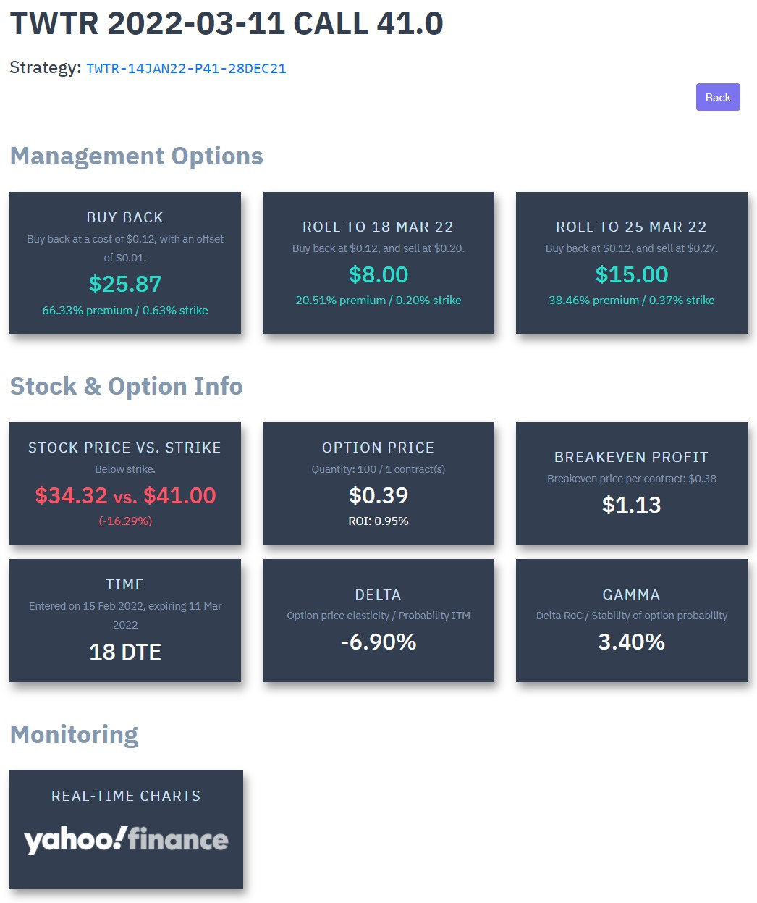

# Monitor
Provides an overview of open options positions. It includes a quick back-of-the-envelope calculation of returns from buying back, rolling one week out, and rolling two weeks out.

    

More details on each position:

    

